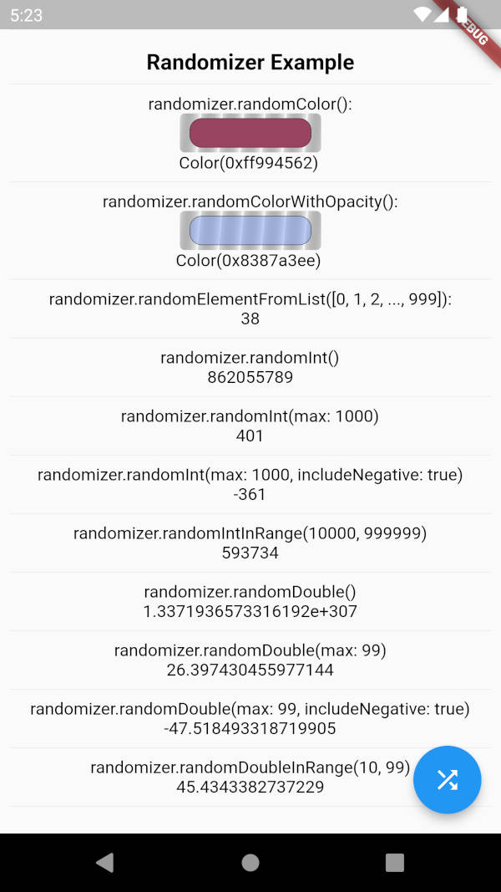

# randomizer_null_safe
Forke of [randomizer](https://github.com/SivaramNalliboyana/Randomizer) with nullsafety, optimized code, new functions and example project.

## Examples

### Generate random color
```
Color color1 = Randomizer.instance.randomColor();
Color color2 = Randomizer.instance.randomColorWithAlpha();
Color color3 = Randomizer.instance.randomColorWithOpacity();
```

### Get random value from a non-empty list
```
int num = Randomizer.instance.randomElementFromList([0, 1, 2, 3]);
```

### Get random integer values
```
int num1 = Randomizer.instance.randomInt();
int num2 = Randomizer.instance.randomInt(max: 1000);
int num3 = Randomizer.instance.randomInt(includeNegative: true);
int num4 = Randomizer.instance.randomInt(max: 1000, includeNegative: true);
int num5 = Randomizer.instance.randomIntInRange(10000, 999999);
```

### Get random double values
```
double num1 = Randomizer.instance.randomDouble();
double num2 = Randomizer.instance.randomDouble(max: 99);
double num3 = Randomizer.instance.randomDouble(includeNegative: true);
double num4 = Randomizer.instance.randomDouble(max: 99, includeNegative: true);
double num5 = Randomizer.instance.randomDoubleInRange(10, 99);
```

## Screenshot


